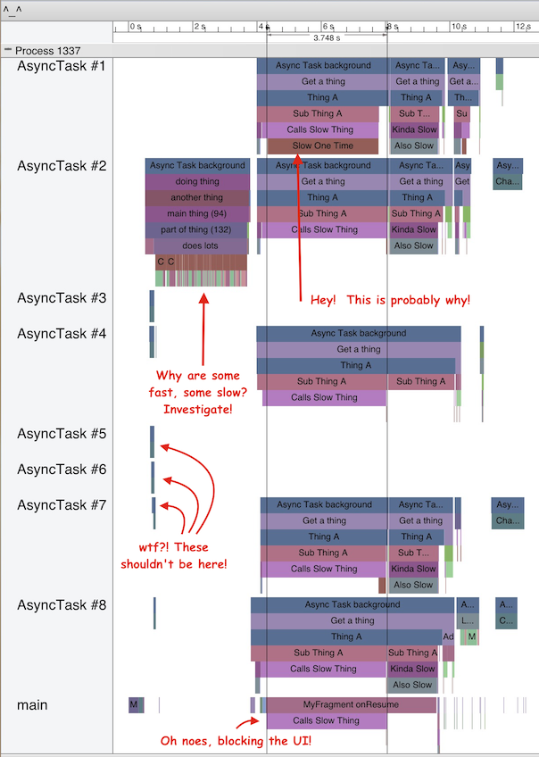

# LocalTrace
#### A complete* replacement for all* your [android.os.Trace](https://developer.android.com/reference/android/os/Trace.html) needs.
or
#### How I Learned To Stop Reading Logs, And Love Visualizations

*: for my purposes

## What
A (nearly) drop-in replacement for single-process use of `android.os.Trace.beginSection`/`endSection`,
but it doesn't have any dependencies (outside of Android API v1).

And look!  It gives you this!



## How
Sprinkle `LocalTrace.beginSection("name")` / `LocalTrace.endSection()` calls around your code (each section
MUST begin/end on the same thread), and run the app.  Logs are flushed to disk roughly every second, so wait
until at least a second after the interesting things have finished.  A new file will be created every time
your app process starts, so the results won't clobber each other.

Afterward, pull the file via `adb pull` (or `adb shell run-as com.example.yourapp cat file.trace > file.trace`
for devices where pull doesn't work).  Then `cat begin_trace.html file.trace end_trace.html > result.html` to put
the trace output in the middle of the HTML file.  (you need to avoid newlines and `"` in your section names
because of this)

Then just open the file in Chrome.  It _only_ works in Chrome, unfortunately.  Take it up with the systrace
team for Android if you find this repugnant, it's not something I can fix :|

## Why
[Systrace](http://developer.android.com/tools/debugging/systrace.html) is cool!
It gives you a wonderful overview of parallel processes and what they're doing,
which can help you diagnose problems like "why is this so damn slow".

But.  It requires systrace support on the device, and many manufacturers disable it.
And [custom tracing sections require API v18+](https://developer.android.com/reference/android/os/Trace.html#beginSection%28java.lang.String%29),
which are wonderfully useful to see not just "this is doing disk access here", but
_why_ it's happening in the first place.

Also but.  `systrace.py` is pretty tightly bound to `atrace` itself, which means your
device has to be plugged in, and it'll end itself after not too long anyway.  Yeah, you
can feed it a file, but you still need to actually call `adb shell atrace -z`.

So, while trying to speed things up and find out why it's sometimes slow and sometimes not,
and needing to work on Gingerbread devices, I figured out the log format and decided to skip
the whole `atrace` thing.  I chopped up the output file from a run, made a [logging helper
class](LocalTrace.java), and now I can trace every run, every time, and diagnose later when
I actually see what I'm looking for.

It has helped _immensely_.

## Save yourself some pain
Both Android Studio and Eclipse support templates that can surround your code.
Don't write it all out every time.  I use a "Live Template" in Android Studio to save what
little sanity I have left:
```Java
com.example.LocalTrace.beginSection("$CLASS$ : $METHOD$ ($LINE$)");
try {
$SELECTION$
} finally {
com.example.LocalTrace.endSection();
}
```
Then simply select the code you want to trace, hit (on a Mac) `cmd-opt-T`, then `t`
to automagically generate a unique, semi-descriptive named trace section.  Sprinkle around
your code in interesting areas, see what turns up.

## Save even more pain
Combining the output with the begin/end HTML files, and then opening in Chrome, can be a bit of a
pain.  So I use this:
```bash
#!/bin/bash
cat begin_trace.html "$1.trace" end_trace.html > "$1.html" && open -a "Google Chrome.app" "$1.html"
```
Then, given `file.trace`, just `./that_script file` and voila, you're viewing it.
